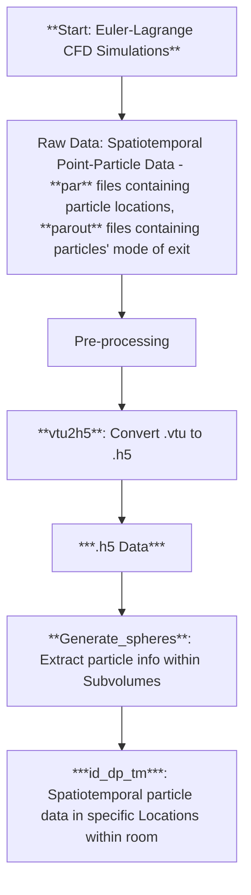

# MADRAS
**MA**tlab turbulent **D**ispersion **R**oom-scale **A**nalysis **S**oftware (**MADRAS**) is a software for calculating turbulent dispersal statistics from Lagrangian particle tracks generated from Euler-Lagrange DNS, LES, and RANS.

The software and its workflow are used to derive meaningful statistical information from the novel ***statistical overloading methodology*** employed for one-way coupled turbulent dispersal problems. The software has also been specialized for predicting aerosol dispersal and pathogen concentration in indoor spaces to compute quantities such as cumulative exposure time (CET) and Safe Occupancy Limit. The use/distribution of this code is allowed ***ONLY*** after approval by Prof. S. Balachandar **(bala1s@ufl.edu)**, the project PI. This code was written and conceptualized at the University of Florida at the Computational Multiphysics Group and the CM3C by Dr. K.A. Krishnaprasad, Dr. Jorge Salinas, Prof. Nadim Zgheib, and Prof. S. Balachandar. For further details on implementation and utility, please get in touch with Dr. Krishnaprasad **(krishnap.kalivel@ufl.edu)**.

# Statistical Overloading
Turbulent dispersal processes are two-point two-time stochastic processes that depend on the locations of the pollutant's origin (**source**) and where the concentration is monitored (**sink**). Quite often, these flows are one-way coupled, such as in aerosol transmission of diseases, occupational hazards introduced through chemicals, droplet impingement on airfoils, and atmospheric dispersion in urban settings. Statistical overloading is an Euler-Lagrange simulation strategy wherein the simulation domain is overloaded with Lagrangian particles that are randomly seeded across both time and space. The Lagrangian point-particles and their dispersal are monitored by tracking their spatiotemporal data over the course of the simulation. For further details on the statistical overloading methodology and its implementation, please refer to the published works of [Krishnaprasad et al., 2025](https://www.sciencedirect.com/science/article/pii/S0021850225000679?casa_token=OltE_e7JP0AAAAAA:sNyJROtb4YO5C6vd4ZwAZl_GXRdZWJyIck9YYAeB_HS9d82FCEb4MTxkH9c8_ftCWTRgeGQ42w).

# Workflow
A brief overview of the workflow is presented here. The first step is to generate spatiotemporal data of the Lagrangian trajectory of our pollutants through Euler-Lagrange CFD Simulations or experiments. An example of a simulation for a $10 \times 10 \times 3.2$ m3<\sub> room is provided in [Simulation](Simulation).

## Pre-processing step

## Homogenized statistics - Averaged over all possible source-sink locations

# List of publications
Listed below are the published works that utilize MADRAS and its workflow for statistical post-processing.
1. K.A. Krishnaprasad, N. Zgheib, S. Balachandar, [A statistical approach to turbulent dispersal of aerosols for accurate prediction of concentration and associated uncertainties](https://journals.aps.org/prfluids/abstract/10.1103/PhysRevFluids.10.054302)," Physical Review Fluids (2025).
2. K.A. Krishnaprasad, R. Patel, C. El Khoury, A.J. Banko, N. Zgheib, S. Balachandar, [The statistical overloading framework for accurate evaluation of pollutant dispersal with rigorous uncertainty estimation](https://doi.org/10.1016/j.jaerosci.2025.106590)," Journal of Aerosol Science (2025).
3. R. Patel, K.A. Krishnaprasad, N. Zgheib, J.S. Salinas, S. Balachandar, [Influence of internal heating and natural convection on airborne transmission of viral diseases](https://iopscience.iop.org/article/10.1088/1873-7005/ad8376/pdf),” Fluid Dynamics Research (2024).
4. K.A. Krishnaprasad, N. Zgheib, M.Y. Ha, K. Choudhary, C.Y. Choi, S. Jang, K.S. Bang, S. Balachandar, [Existence of a non-zero worst-case ACH for short-term exposure in ventilated indoor spaces](https://doi.org/10.1155/2024/6642205)," Indoor Air (2024).
5. K. Choudhary, K.A. Krishnaprasad, N. Zgheib, M.Y. Ha, S. Balachandar, [Effect of room size, shape, AC placement, and air leakage on indoor airborne viral transmission](https://doi.org/10.1016/j.buildenv.2023.110834),” Building and Environment (2023).
6. K. Choudhary, K.A. Krishnaprasad, S. Pandey, N. Zgheib, J.S. Salinas, M.Y. Ha, S. Balachandar, [Effectiveness of RANS in predicting indoor airborne viral transmission: A critical evaluation against LES](https://www.sciencedirect.com/science/article/pii/S0045793023000701),” Computers & Fluids (2023).
7. K.A. Krishnaprasad, J.S. Salinas, N. Zgheib, S. Balachandar, [Fluid mechanics of air recycling and filtration for indoor airborne transmission](https://doi.org/10.1063/5.0135718)," Physics of Fluids (2023).
8. J.S. Salinas, K.A. Krishnaprasad, N. Zgheib, S. Balachandar, [Improved guidelines of indoor airborne transmission taking into account departure from the well-mixed assumption](https://link.aps.org/doi/10.1103/PhysRevFluids.7.064309),” Physical Review Fluids (2022).
